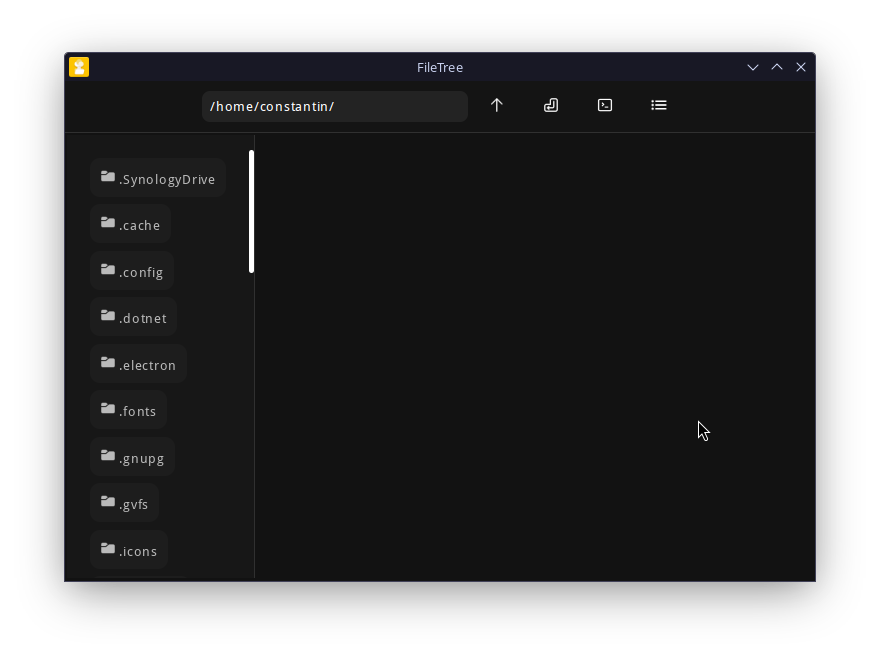
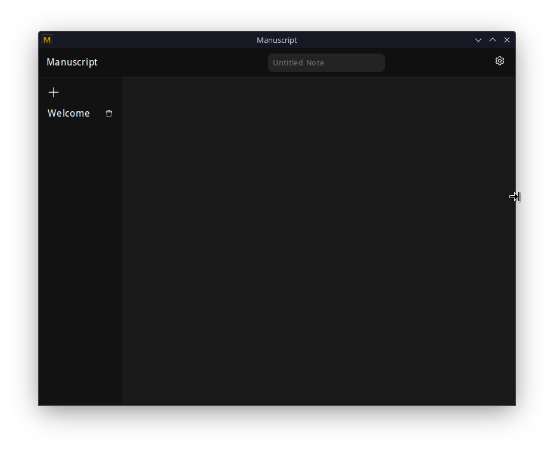

<h1 align=center>Codelink</h1>
 

<table>
<tr>
<td>
<a href="#filetree">
 
<h3 align=center>FileTree</h3>
</a>
</td>
<td>
<a href="#tin">

<h3 align=center>Tin Browser</h3>
</a>
</td>
<td>
<a href="#manuscript">
 
<h3 align=center>Manuscript</h3>
</a>
</td>
</tr>
</table>

## Tin
Tin is a simple browser that is optimized for tiling window managers, quick bug fixing and small screens. Tools like a command pallet and bookmarks are integrated.

[Learn more about Tin](tin/tin.md)

## FileTree
FileTree is a powerful GUI based file manager that features several helpful built in tools, to simplify your workflow.

[Learn more about FileTree](filetree/filetree.md)

## Manuscript
Manuscript is a feature rich note-taking app. It supports linked notes, embedded files and syntax highlighting for code.

[Learn more about Manuscript](manuscript/manuscript.md) | [Website](https://wervice.github.io/manuscript)

## Package Management Library
PMLib provides a warapper around DNF, APT and PacMan. 
This makes it easier to manage packages under Linux using NodeJS.

You can find [the documentation here](zentrox/pmlib.md).

## Zentrox
> [!IMPORTANT]
> Zentrox is still in development and not ready for production

<!-- Demo | Benchmarks | ...  -->

Zentrox is  a powerful and fast server interface. It helps you manage the system and create a fast cloud. 
It is focused on simplicity and versatility.

More on [r/Zentrox](https://www.reddit.com/r/Zentrox/).

# Download
You can download the latest release here:
|App|Release|
|---|-------|
|Tin|[1.9](https://github.com/Wervice/Codelink/releases/tag/1.9)|
|Manuscript|[1.7](https://github.com/Wervice/Codelink/releases/tag/1.7)|
|FileTree|[1.7](https://github.com/Wervice/Codelink/releases/tag/1.7)|