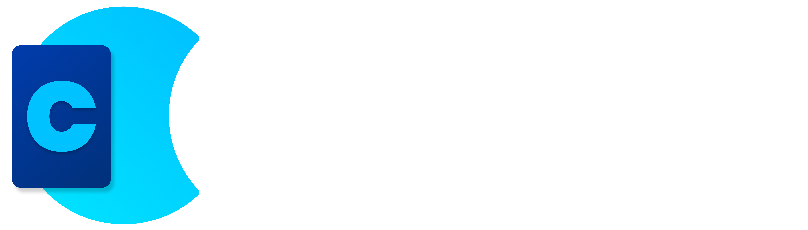
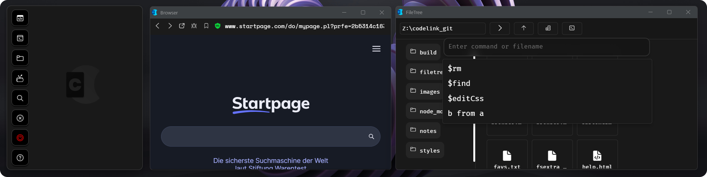

  

Codelink has lots of tools that are developed and designed for developers.   
It can support your workflow and help you get anoying tasks done faster.   
I will upload some release and build over time.   
Please star the project and follow, to get reminders when a update is online.

 

## Installation
> Codelink is designed for developers

To run Codelink on your computer, you can go to the release page and download the Windows zip.    
There, you can find an exe file. All you need to do now, is doubble click it and it launches.   
If would recommend to store it in your home folder and add a desktop shortcut. Please don't try to take
the exe and run it standalone. You may almost certainly breake your download.    

If you want to try Codelink on Linux or the above method failed, please try the following or open an issue

1. Download code as zip & unpack
2. Run `npm install nw fs-extra`
3. Run `npm run dev`

## Features
- Easy app integration
- Simple and fast browser with bug assistant
- Inteligent filemanger optimized for developers
- Encryption and easy file access

## Early stage
Codelink is still in a very early stage.   
There will soon be a browser update, an improved design and more functions.   
So, please give me feedback and stick around, so you want miss the update.

## Legal
Codelink is released under the Apache 2.0 license.   
It uses NW.js which is released under the MIT License.   
To support the design of my app, I also use Icons from [Icons8](https://icons8.com)

## Questions and feedback
If you have any problems, you can contact me:

[Wervice@proton.me](wervice@proton.me)

I also have a Fosstodon Account where you can follow me and get updates: [Wervice](https://fosstodon.org/@wervice)