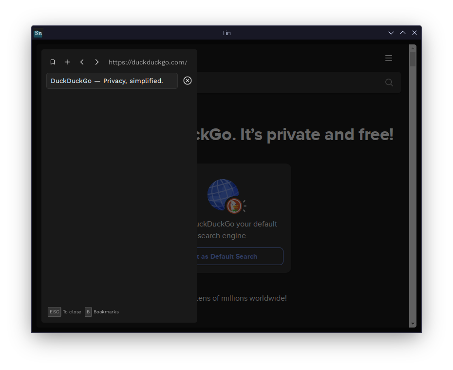

<h1 align=center>Tin Browser</h1>

 

### Tin is a simple web browser, aiming for minimalism and powerful features. It is designed to work well in small spaces.

## ⚠️ Codelink is not being worked on!
Developing for any of the Codelink projects has been paused except for Zentrox, which has been moved to a [seperate repository](https://github.com/wervice/zentrox).
Currently, I do not plan on working on Codelink again. I did not archive this repository, as I may come back to it.
The current state of the projects may contain bugs and does not use the latest versions of NW.js and Chromium. Thus I do not recommend using any of the applications.
Thank you for showing interest in Codelink 🙂

## Features
Tin features several tools for a fast working experience:
1. Command pallet   
    Tin supports a command pallet, that lets you run several tasks from your keyboard.
1. Shortcuts   
    You can control most of Tin using only shortcuts.
1. Always on top   
    Tin lets you toggle always on top mode easily.
1. Bookmarks   
    Tin lets you store your most important sites in your bookmarks, for quick access

## Themes
You can them Tin with:
- Catppuccin
- Nord
- Gray (default)

## Shortcuts
|Key|Description|
|---|---|
|Space|Command pallet|
|t|Tab list|
|b|Bookmarks|
|Esc|Close popups|

## Downloading
You can get Tin for Windows & Linux.   
Please select your version from the link bellow.

> [!NOTE]
> You can run `sudo install.sh` under Linux, to add Tin to your start menu. Otherwise, you can also run the `.elf`.

[Release 1.9](https://github.com/Wervice/Codelink/releases/tag/1.9)
